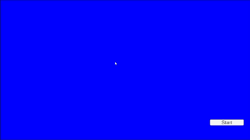

### Game of Life

Conway's Game of life and other cellular automaton experiments implemented in Unity.

#### Rules:

1. If a cell is alive, it survives to the next generation if it has 2 or 3 live neighbors; otherwise it
   dies.
2.  If a cell is dead, it comes to life in the next generation if it has exactly 3 live neighbors; otherwise
   it stays dead.

#### Random initialization

#### Glider Spaceship. Most common and first discovered spaceship.

To do:

* ~~Create simple visualization structure~~
* ~~Create clickable grid to draw patterns~~
* ~~Fix bug with the rules, each grid should be a snapshot~~
* Change alive/dead to continuous values, 0 to 10
* Add support to different rules
* Add support to different neighbors size and shapes
* Fix camera and Cell size
* Improve UI and graphics